# ARICO — Autonomous Retail Intervention & Campaign Orchestrator

A LangGraph-based agentic backend that responds to retail sales loss alerts. When a store flags declining revenue, ARICO spins up parallel SQL analyst sub-agents to investigate the data, figures out the root cause, and either deploys a campaign automatically or pauses for human approval depending on the risk level.

The core design decision: rather than calling hardcoded mock tools that return pre-written data, each sub-agent actually writes SQL, runs it against a real SQLite database, and reasons about what it finds. The root cause is *discovered*, not pre-programmed. This means the same agent logic works whether the problem is a competitor promo, a stockout, a product quality issue, or just normal seasonal variance — because it's reading real data, not pattern-matching on keywords.

---

## Setup

**Prerequisites:** Python 3.10+, `uv` (or pip), an Anthropic or OpenAI API key.

No database setup needed — ARICO uses a single SQLite file (`arico.db`) for both retail data and LangGraph checkpoints. It automatically creates and seeds the database on the very first run, regardless of whether you start the CLI or the API server first.

```bash
cd arico

# Install dependencies
uv sync

# Copy and fill in your API key
cp .env.example .env
```

If you don't have `uv`:
```bash
python3 -m venv .venv
source .venv/bin/activate
pip install -e ".[dev]"
```

### Environment variables

**Required — at least one LLM key:**

```env
ANTHROPIC_API_KEY=your-key   # preferred (Claude Sonnet)
# or
OPENAI_API_KEY=your-key      # fallback (GPT-4o-mini)
```

**LangSmith tracing (optional but recommended):**

```env
LANGCHAIN_TRACING_V2=true
LANGCHAIN_API_KEY=your-langsmith-key
LANGCHAIN_PROJECT=arico
LANGSMITH_ENDPOINT=your-endpoint
```

Enables full trace visibility in LangSmith — every LLM call is a named child span with `store_id`, `revenue_at_risk`, and analyst tags. Without these the graph still runs; you just won't see traces.

**Other optional variables:**

| Variable | Default | Description |
|----------|---------|-------------|
| `ARICO_LLM_PROVIDER` | auto-detected | Force `anthropic` or `openai` |
| `ARICO_LLM_MODEL` | auto-detected | Override model (e.g. `claude-sonnet-4-6`) |
| `ARICO_DB_PATH` | `arico.db` | SQLite database path |
| `ARICO_MAX_HITL_ITERATIONS` | `3` | Max modify-and-regenerate loops before auto-archive |
| `ARICO_AUTO_DEPLOY_COST_RATIO` | `0.3` | Campaign cost / revenue_at_risk threshold for auto-deploy |
| `ARICO_AUTO_DEPLOY_MIN_ROI` | `1.5` | Minimum estimated ROI for auto-deploy |
| `ARICO_TOOL_MAX_RETRIES` | `2` | LLM call retries with exponential backoff (1s, 2s, ...) |

---

## Running

### CLI

```bash
uv run python -m arico.main
```

Prompts you to select a store alert, then runs the full graph. If the campaign requires approval, you'll be asked to approve, reject, or provide modification feedback inline.

### API server

```bash
uv run uvicorn api.server:app --reload
```

Swagger UI at `http://localhost:8000/docs`.

### LangSmith evaluations

```bash
# All evaluators (deterministic + LLM-as-judge)
uv run python -m evals.run

# Fast mode — deterministic checks only, no LLM cost
uv run python -m evals.run --deterministic

# Single store
uv run python -m evals.run --store 303
```

Requires `LANGCHAIN_API_KEY` in `.env`.

---

## How it works

```
Alert
  └── fetch_store_metadata
        └── assess_situation
              └── [parallel via Send()]
                    ├── sales_analyst
                    ├── competitor_analyst
                    ├── inventory_analyst
                    └── feedback_analyst
                          └── synthesize_findings
                                ├── [no action needed] → final_report
                                └── [action needed]
                                      └── generate_campaign
                                            └── calculate_cost
                                                  ├── [low risk] → execute_promotion → final_report
                                                  └── [high risk] → request_approval (HITL interrupt)
                                                                          ├── approved → execute_promotion
                                                                          ├── rejected → archive_rejected
                                                                          └── modified → generate_campaign (loop, max 3)
```

A few things worth calling out:

- `assess_situation` decides *which* analysts to spawn based on what's unknown — it uses `Send()` for dynamic fan-out rather than always running all four. A high-confidence alert with an obvious cause might skip straight to synthesis.
- `synthesize_findings` is a senior-analyst node that combines all four reports and decides whether intervention is actually warranted. Store 303 (Bengaluru) is the "no action" case — the June dip matches the monsoon benchmark exactly, so the agent correctly does nothing rather than generating a campaign for a non-problem.
- The HITL loop supports modify-with-feedback, not just approve/reject. The campaign is regenerated with the feedback baked in, up to 3 iterations before it auto-archives.

---

## Agentic workflow

```mermaid
flowchart LR

    classDef io         fill:#d1fae5,stroke:#059669,color:#064e3b,font-weight:bold
    classDef process    fill:#dbeafe,stroke:#2563eb,color:#1e3a8a
    classDef analyst    fill:#ccfbf1,stroke:#0d9488,color:#134e4a
    classDef synthesis  fill:#fef9c3,stroke:#ca8a04,color:#713f12,font-weight:bold
    classDef campaign   fill:#ede9fe,stroke:#7c3aed,color:#4c1d95
    classDef hitl       fill:#fee2e2,stroke:#dc2626,color:#7f1d1d,font-weight:bold
    classDef langsmith  fill:#ffedd5,stroke:#ea580c,color:#7c2d12
    classDef decision   fill:#f1f5f9,stroke:#64748b,color:#0f172a

    subgraph MAIN ["  ARICO  LangGraph StateGraph  "]
        direction TB

        ALERT(["ALERT\nstore_id  loss_reason\nrevenue_at_risk  product_category\nestimated_units_at_risk"]):::io

        FSM["fetch_store_metadata\nPhase 1  no LLM\nDirect SQL  stores JOIN products JOIN inventory\nOutputs StoreMetadata + ProductInfo list"]:::process

        AS["assess_situation\nPhase 2  LLM call\nprompt orchestrator_agent.txt\nReads Alert + StoreMetadata\nOutputs SituationAssessment\n  data_sufficient  knowledge_gaps  agents_to_spawn"]:::process

        subgraph ANALYSTS ["  Phase 3  Parallel SQL Analysts  LangGraph Send() API  dynamic fan-out  "]
            direction LR
            SA["sales_analyst\nSQL daily_sales + monthly_benchmarks\nStep 1 LLM writes SELECT queries\nStep 2 LLM analyzes rows\nOutputs AnalystReport\n  severity  key_findings  summary"]:::analyst
            CA["competitor_analyst\nSQL competitor_activity\nStep 1 LLM writes SELECT queries\nStep 2 LLM analyzes rows\nOutputs AnalystReport"]:::analyst
            IA["inventory_analyst\nSQL inventory + products\nStep 1 LLM writes SELECT queries\nStep 2 LLM analyzes rows\nOutputs AnalystReport"]:::analyst
            FA["feedback_analyst\nSQL customer_feedback\nStep 1 LLM writes SELECT queries\nStep 2 LLM analyzes rows\nOutputs AnalystReport"]:::analyst
        end

        SF["synthesize_findings\nPhase 4  LLM call\nprompt synthesize_findings.txt\nCombines all 4 AnalystReports\nOutputs RecommendationDecision\n  action_needed  root_cause  reasoning  confidence"]:::synthesis

        FR_NA(["final_report  NO ACTION\nExample Store 303 Bengaluru\nJune actual 13.0 units per day\nmatches monsoon benchmark 13.4\nNo campaign generated  routes to END"]):::io

        GC["generate_campaign\nPhase 5  LLM call\nprompt campaign_system.txt\nReads RecommendationDecision + all reports\nOutputs Campaign\n  type  discount_pct  target_skus  channels  rationale"]:::campaign

        CC["calculate_cost\ndeterministic  no LLM\nmargin_cost = units x price x discount_pct\nmarketing_spend per channel\nOutputs CostEstimate\n  total_cost  estimated_roi  risk_level  risk_factors"]:::campaign

        RG{"Risk Gate\ncost_ratio <= 0.30\nAND ROI >= 1.5x\nAND risk_level = low?"}:::decision

        EP["execute_promotion\ndeploy_promotion LangChain tool\nOutputs DeploymentResult\n  status  promotion_id  estimated_reach  start_date"]:::process

        RA["request_approval\nLangGraph interrupt\nGraph pauses  full state checkpointed\nto arico.db via SqliteSaver\nBrand owner sees campaign + CostEstimate\nSurvives server restart\nResumes via Command resume"]:::hitl

        AR["archive_rejected\nLogs rejection reason\nDeploymentResult status = skipped\nNo promotion deployed"]:::hitl

        FR_DEPLOY(["final_report  DEPLOYED\nstore  diagnosis  campaign\ncost  promo_id  estimated_reach"]):::io

        FR_REJECT(["final_report  REJECTED\nstore  diagnosis\nrejection reason  iteration count"]):::io

        ALERT --> FSM
        FSM  --> AS

        AS -->|"Send sales_analyst, state"| SA
        AS -->|"Send competitor_analyst, state"| CA
        AS -->|"Send inventory_analyst, state"| IA
        AS -->|"Send feedback_analyst, state"| FA

        SA --> SF
        CA --> SF
        IA --> SF
        FA --> SF

        SF -->|"action_needed = False"| FR_NA
        SF -->|"action_needed = True"| GC

        GC --> CC
        CC --> RG

        RG -->|"auto-deploy\ncost_ratio <= 0.30  ROI >= 1.5x"| EP
        RG -->|"human review\nrisk = medium or high"| RA

        RA -->|"approved"| EP
        RA -->|"rejected"| AR
        RA -->|"modified + feedback\nmax 3 iterations  then auto-archive"| GC

        EP --> FR_DEPLOY
        AR --> FR_REJECT
    end

    subgraph LS ["  LangSmith Tracing  LANGCHAIN_TRACING_V2=true  LANGCHAIN_PROJECT=arico  "]
        direction TB

        LS1["ARICO  Store 101  42000 at risk\ntags arico  store-101  shoes\nmetadata store_id  revenue_at_risk  product_category\nTop-level run  wraps entire graph execution"]:::langsmith
        LS2["  Assess Situation  Data Sufficiency\n  tags orchestrator  assess_situation  phase-2\n  metadata store_id  revenue_at_risk"]:::langsmith
        LS3["  Sales Analyst  Step 1 Generate SQL\n  tags analyst  sales_analyst  sql-generation\n  metadata store_id  analyst"]:::langsmith
        LS4["    Sales Analyst  Step 2 Analyze Results\n    tags analyst  sales_analyst  analysis\n    metadata row_count  store_id"]:::langsmith
        LS5["  Competitor Analyst  Step 1 + Step 2\n  Inventory Analyst   Step 1 + Step 2\n  Feedback Analyst    Step 1 + Step 2\n  All parallel  each with sql-generation + analysis spans"]:::langsmith
        LS6["  Synthesize Findings  Root Cause Diagnosis\n  tags synthesis  decision\n  metadata reports_available  store_id"]:::langsmith
        LS7["  Campaign Generator  Initial  iter 1\n  tags campaign-generator  initial\n  metadata iteration  root_cause  has_human_feedback false"]:::langsmith
        LS8["  Campaign Generator  Re-generation  iter 2\n  tags campaign-generator  re-generation\n  metadata iteration 2  has_human_feedback true\n  Only appears if brand owner sends modified"]:::langsmith

        LS1 --> LS2 --> LS3 --> LS4 --> LS5 --> LS6 --> LS7
        LS7 -.->|"only on modified"| LS8
    end

    AS  -.->|"llm.with_config run_name, tags, metadata\nevery LLM call is a named child span"| LS2
    SF  -.->|"reports_available captured\nin span metadata"| LS6
    GC  -.->|"iteration + root_cause\nin span metadata"| LS7
```



---

## Data flow

```mermaid
flowchart LR

    classDef input    fill:#d1fae5,stroke:#059669,color:#064e3b,font-weight:bold
    classDef db       fill:#e0f2fe,stroke:#0369a1,color:#0c4a6e
    classDef tool     fill:#ccfbf1,stroke:#0d9488,color:#134e4a
    classDef llm      fill:#ede9fe,stroke:#7c3aed,color:#4c1d95
    classDef state    fill:#fef9c3,stroke:#ca8a04,color:#713f12
    classDef output   fill:#d1fae5,stroke:#059669,color:#064e3b

    ALERT["ALERT JSON\nstore_id 101\nloss_reason shoe sales dropping\nrevenue_at_risk 42000\nproduct_category shoes\nestimated_units_at_risk 30"]:::input

    subgraph DB ["  arico.db  SQLite  retail data  LangGraph checkpoints  thread registry  "]
        direction TB
        T_STORES["stores\nstore_id  name  city  state\nlocation_type  avg_monthly_foot_traffic  size_sqft"]:::db
        T_PROD["products\nsku  name  category\nbase_price  unit_margin_pct"]:::db
        T_INV["inventory\nstore_id x sku\nstock_units  reorder_point\nmax_allowable_discount_pct  last_restock_date"]:::db
        T_SALES["daily_sales\nstore_id x sku x sale_date\nunits_sold  revenue\n~1800 rows  90 days x 5 stores x 4 SKUs"]:::db
        T_COMP["competitor_activity\ncompetitor_name  activity_type\ndescription  start_date  end_date"]:::db
        T_FB["customer_feedback\nstore_id x sku\nrating 1-5  comment  feedback_date"]:::db
        T_BM["monthly_benchmarks\nstore_id x category x month\navg_daily_units  avg_daily_revenue  notes"]:::db
        T_CHK["threads  LangGraph checkpoint tables\nthread_id  alert_json  status\ncheckpoints  checkpoint_blobs  checkpoint_writes\nWritten by SqliteSaver after every node"]:::db
    end

    subgraph TOOLS ["  Tool Layer  "]
        direction TB
        LOOKUP["get_store_metadata\nDirect SQL  no LLM\nJOIN stores + products + inventory\nReturns dict parsed into StoreMetadata"]:::tool
        SQL["run_sql_query  LangChain tool\nSELECT only  INSERT UPDATE DELETE blocked\nReturns columns  rows  row_count\nUsed by all 4 analyst agents"]:::tool
        PROMO["deploy_promotion  LangChain tool\nMock promotion deployment\nWrites result back to ARICOState\nReturns status  promotion_id  estimated_reach"]:::tool
    end

    subgraph LLMS ["  LLM Transformations  Claude Sonnet-4-6 or GPT-4o-mini  temperature 0.2  "]
        direction TB
        L_ASSESS["assess_situation\nprompt orchestrator_agent.txt\nInput Alert + StoreMetadata JSON\nOutput JSON parsed into SituationAssessment\n  data_sufficient bool\n  knowledge_gaps list of KnowledgeGap enums\n  agents_to_spawn list of AgentType enums\n  reasoning str"]:::llm
        L_SQL["analyst Step 1  x4 parallel\nprompts analyst_sales  competitor  inventory  feedback .txt\nInput Alert + SCHEMA_DDL + task description\nOutput JSON  queries list of SELECT"]:::llm
        L_ANALYZE["analyst Step 2  x4 parallel\nSame prompt context\nInput SQL query results columns + rows\nOutput JSON parsed into AnalystReport\n  key_findings list of str\n  summary str\n  severity none  low  medium  high"]:::llm
        L_SYNTH["synthesize_findings\nprompt synthesize_findings.txt\nInput 4x AnalystReport + triage reasoning\nOutput JSON parsed into RecommendationDecision\n  action_needed bool\n  root_cause str\n  reasoning str\n  confidence float 0-1\n  no_action_reason str or null"]:::llm
        L_CAMP["generate_campaign\nprompt campaign_system.txt\nInput RecommendationDecision + all reports + optional human_feedback\nOutput JSON parsed into Campaign\n  campaign_name  promotion_type  discount_pct\n  target_skus  channels  duration_days  rationale"]:::llm
    end

    subgraph STATE ["  ARICOState TypedDict  LangGraph graph state  checkpointed to arico.db after every node  "]
        direction TB
        S1["Phase 1 fields\nalert Alert\nstore_metadata StoreMetadata or None\n  StoreMetadata.products list of ProductInfo"]:::state
        S2["Phase 2 fields\nsituation_assessment SituationAssessment or None\nresearch_errors list of str\n  Annotated reducer  parallel-safe append"]:::state
        S3["Phase 3 fields  all parallel-safe via Annotated reducers\nsales_analysis AnalystReport or None\ncompetitor_analysis AnalystReport or None\ninventory_analysis AnalystReport or None\nfeedback_analysis AnalystReport or None"]:::state
        S4["Phase 4+5 fields\nrecommendation RecommendationDecision or None\nproposed_campaign Campaign or None\ncost_estimate CostEstimate or None"]:::state
        S5["HITL + execution fields\nrequires_approval bool\napproval_status ApprovalStatus or None\nhuman_feedback str or None\ndeployment_result DeploymentResult or None\nexecution_log list of str  Annotated reducer"]:::state
    end

    subgraph OUT ["  Output Artifacts  surfaced in final_report  accessible via GET /threads/id  "]
        direction TB
        O1["RecommendationDecision\naction_needed bool\nroot_cause str\nreasoning str\nconfidence float\nno_action_reason str or null"]:::output
        O2["Campaign\ncampaign_name  promotion_type\ndiscount_pct  target_skus\nchannels  duration_days  rationale"]:::output
        O3["CostEstimate\ntotal_cost  marketing_spend  margin_cost\nestimated_roi  recovery_rate\nrisk_level  risk_factors list of str"]:::output
        O4["DeploymentResult\nstatus deployed  failed  skipped\npromotion_id  estimated_reach\nstart_date  error"]:::output
    end

    ALERT -->|"graph initialized\nalert written to state"| S1
    ALERT -->|"fetch_store_metadata\nPhase 1"| LOOKUP
    LOOKUP -->|"SELECT stores JOIN products\nJOIN inventory WHERE store_id"| T_STORES
    LOOKUP -->|"SELECT"| T_PROD
    LOOKUP -->|"SELECT"| T_INV
    T_STORES -->|"raw rows returned"| LOOKUP
    T_PROD -->|"raw rows returned"| LOOKUP
    T_INV -->|"raw rows returned"| LOOKUP
    LOOKUP -->|"StoreMetadata + ProductInfo list\nparsed by fetch_store_metadata node"| S1

    S1 -->|"alert + store_metadata\nto assess_situation"| L_ASSESS
    L_ASSESS -->|"SituationAssessment\ndata_sufficient  knowledge_gaps\nagents_to_spawn"| S2

    S2 -->|"agents_to_spawn drives\nSend() fan-out"| L_SQL
    L_SQL -->|"SELECT queries\ngenerated by LLM"| SQL
    SQL -->|"query against"| T_SALES
    SQL -->|"query against"| T_COMP
    SQL -->|"query against"| T_INV
    SQL -->|"query against"| T_FB
    SQL -->|"query against"| T_BM
    T_SALES -->|"columns + rows + row_count"| SQL
    T_COMP -->|"columns + rows + row_count"| SQL
    T_INV -->|"columns + rows + row_count"| SQL
    T_FB -->|"columns + rows + row_count"| SQL
    T_BM -->|"columns + rows + row_count"| SQL
    SQL -->|"query results\nto analyst Step 2"| L_ANALYZE
    L_ANALYZE -->|"4x AnalystReport\nsales_analysis  competitor_analysis\ninventory_analysis  feedback_analysis"| S3

    S3 -->|"all analyst reports"| L_SYNTH
    S2 -->|"triage reasoning"| L_SYNTH
    L_SYNTH -->|"RecommendationDecision\naction_needed  root_cause  confidence"| S4

    S4 -->|"recommendation + reports\n+ optional human_feedback"| L_CAMP
    S1 -->|"store_metadata\nfor SKU + discount context"| L_CAMP
    L_CAMP -->|"Campaign\ntype  discount_pct  channels"| S4
    S4 -->|"calculate_cost node\ndeterministic  no LLM\nmargin_cost + marketing_spend"| S4

    S4 -->|"if action needed + approved\nexecute_promotion"| PROMO
    PROMO -->|"DeploymentResult"| S5

    S4 --> O1
    S4 --> O2
    S4 --> O3
    S5 --> O4

    STATE -.->|"SqliteSaver checkpoints\nstate written after every node\nHTIL-safe interrupt preserves full state\nthread survives server restart"| T_CHK
```



---

## Requirement coverage

This section walks through each requirement from the task brief and explains what was built and why.

### LangGraph workflow — parallel execution

The task described a parallel investigation to figure out a localized solution. The implementation uses LangGraph's `Send()` API in `route_after_assessment` to dynamically fan out to whichever analyst agents are needed:

```python
sends = []
for agent_type in assessment.agents_to_spawn:
    sends.append(Send(AGENT_NODE_MAP[agent_type], state))
return sends
```

This is parallel — LangGraph runs all spawned analysts concurrently. More importantly, it's *selective*: the situation assessment node first decides which gaps exist (sales trends? competitor activity? inventory? customer sentiment?) and only spawns the agents that fill those gaps. Spawning all four every time is wasteful for alerts where the cause is already clear.

All four analysts converge back into `synthesize_findings`, which only runs after all of them complete — standard fan-in behaviour using normal edges.

### LangGraph workflow — conditional routing

There are four conditional edges in the graph:

| Edge | Condition | Routes to |
|------|-----------|-----------|
| `assess_situation` → | Data sufficient? Which gaps? | `synthesize_findings` or 1-4 analysts via `Send()` |
| `synthesize_findings` → | Action needed? | `generate_campaign` or `final_report` |
| `calculate_cost` → | ROI + cost ratio within thresholds? | `execute_promotion` or `request_approval` |
| `request_approval` → | Approved / rejected / modified? | `execute_promotion`, `archive_rejected`, or back to `generate_campaign` |

The "no action" path through `synthesize_findings` was added specifically because a system that always generates a campaign — even for normal seasonal dips — would erode brand owner trust. Store 303 demonstrates this: June sales are ~13 units/day, which matches the Bengaluru monsoon benchmark of 13.4. The agent reads that and routes to `final_report` without touching campaign generation.

### LangGraph workflow — human-in-the-loop and pause/resume

HITL is implemented using LangGraph's `interrupt()` in the `request_approval` node:

```python
approval_data = interrupt({
    "message": "Campaign requires approval",
    "campaign": campaign.model_dump(),
    "cost_estimate": cost.model_dump(),
})
```

The graph pauses mid-execution and writes the full state to the SQLite checkpointer. When the brand owner responds via the API, the graph resumes using `Command(resume=approval_data)` — it picks up exactly where it left off without re-running any previous nodes.

Three outcomes are supported:
- **Approved** → executes the campaign as-is
- **Rejected** → archives and generates a final report with the rejection reason
- **Modified** → takes the feedback, loops back to `generate_campaign`, regenerates the campaign with that feedback incorporated, and re-presents for approval (max 3 iterations to prevent infinite loops)

State persistence is handled by `SqliteSaver` from `langgraph-checkpoint-sqlite`. The same `arico.db` file serves both the retail data tables and the LangGraph checkpoint tables (`checkpoints`, `checkpoint_blobs`, `checkpoint_writes`). Thread registry is also persisted to a `threads` table in the same DB, so paused campaigns survive server restarts — you can submit an alert, kill the server, restart it, and the thread is still there waiting for approval.

### State schema

`ARICOState` is a `TypedDict` with explicit types on every field:

```python
class ARICOState(TypedDict):
    alert: Alert                                 # Input
    store_metadata: StoreMetadata | None         # Phase 1: store + inventory context
    situation_assessment: SituationAssessment | None  # Phase 2: which analysts to run
    sales_analysis: AnalystReport | None         # Phase 3: parallel analyst outputs
    competitor_analysis: AnalystReport | None
    inventory_analysis: AnalystReport | None
    feedback_analysis: AnalystReport | None
    research_errors: Annotated[list[str], _merge_errors]
    recommendation: RecommendationDecision | None  # Phase 4: action vs. no-action
    proposed_campaign: Campaign | None
    cost_estimate: CostEstimate | None
    requires_approval: bool
    approval_status: ApprovalStatus | None
    human_feedback: str | None
    deployment_result: DeploymentResult | None
    iteration_count: int
    execution_log: Annotated[list[str], _merge_logs]
```

`research_errors` and `execution_log` use LangGraph's `Annotated` reducer pattern — parallel analyst nodes can all append to these lists without overwriting each other's results.

All LLM outputs are parsed into Pydantic models (`SituationAssessment`, `AnalystReport`, `RecommendationDecision`, `Campaign`, `CostEstimate`). No node writes raw strings to state.

### Tool usage

The task mentioned three tool categories:

**Competitor intelligence** — `competitor_analyst` is a SQL-based agent that queries the `competitor_activity` table. Rather than returning a pre-written summary, it generates SQL, runs it, and analyzes the results. For store 101 it finds Metro Shoes launched a 20% off promo on June 1; for store 505 it finds Decathlon opened 1.2 km away on April 28. The same agent handles both, because it's reading data, not following a script.

**Inventory/ERP retrieval** — Two components: `get_store_metadata()` does a direct SQL lookup at graph start to populate store context (products, stock levels, reorder points, max discount). `inventory_analyst` is a separate SQL agent that runs deeper queries mid-investigation — it's the one that discovers store 202's SHOE-001 has 2 units left against a reorder point of 30.

**Promotion execution** — `deploy_promotion()` in `promotion_tool.py` handles campaign deployment. It writes the deployment result back to state, which is then summarised in the final report.

**SQL tool safety** — `run_sql_query` only permits SELECT statements. INSERT, UPDATE, DELETE, and DROP return an error rather than executing. This prevents any analyst from accidentally mutating the database.

### Structured LLM outputs

Every LLM call uses `with_config()` to name the run and tag it, then parses the response into a Pydantic model via `json.loads()`. Example from `assess_situation`:

```python
response = llm.with_config(
    run_name="Assess Situation | Data Sufficiency",
    tags=["orchestrator", "assess_situation", "phase-2"],
    metadata={"store_id": alert.store_id, ...},
).invoke([SystemMessage(...), HumanMessage(...)])

parsed = json.loads(response.content)
assessment = SituationAssessment(
    data_sufficient=parsed["data_sufficient"],
    knowledge_gaps=[KnowledgeGap(g) for g in parsed["knowledge_gaps"]],
    agents_to_spawn=[AgentType(a) for a in parsed["agents_to_spawn"]],
    reasoning=parsed["reasoning"],
)
```

If parsing fails, every node has a fallback — `assess_situation` falls back to spawning all four agents, `generate_campaign` falls back to a minimal safe campaign. The graph never crashes on an LLM output format error.

### LangSmith tracing

All LLM calls are tagged and named. The trace tree for a typical alert looks like:

```
ARICO | Store 101 | ₹42,000 at risk          ← top-level run (from run_config)
  ├── Assess Situation | Data Sufficiency     ← assess_situation node
  ├── Sales Analyst | Step 1: Generate SQL   ← parallel
  ├── Sales Analyst | Step 2: Analyze Results
  ├── Competitor Analyst | Step 1: Generate SQL
  ├── Competitor Analyst | Step 2: Analyze Results
  ├── ...
  ├── Synthesize Findings | Root Cause Diagnosis
  └── Campaign Generator | Initial (iter 1)
```

Each run has `store_id` and `revenue_at_risk` in metadata, so you can filter the LangSmith dashboard by store. The two-step pattern for each analyst (generate SQL → analyze results) makes it easy to see exactly what SQL the agent wrote and what it concluded from the results.

LangSmith credentials are configured in the [Setup](#setup) section above.

### Error handling

Each node handles its own failure modes:

- **LLM call fails** (`assess_situation`): falls back to spawning all four analysts. Conservative — better to do extra work than skip needed analysis.
- **LLM call fails** (`synthesize_findings`): falls back to `action_needed=True` with a note that synthesis failed. Better to surface a human review than silently drop an alert.
- **SQL tool error**: `run_sql_query` catches all exceptions and returns `{"error": "..."}` rather than raising. The analyst LLM sees the error and notes it in its report.
- **Invalid approval status**: `route_after_approval` catches unexpected values and routes to `archive_rejected` with a log entry.
- **Execution failure**: `execute_promotion` catches deployment errors, writes the error to state, and the final report includes it.

### LangSmith evaluations

An evaluation suite in `evals/` runs the full ARICO graph against all 5 store scenarios and scores the outputs.

**Evaluators:**

| Evaluator | Type | What it checks |
|-----------|------|----------------|
| `action_decision_correct` | Deterministic | Did `action_needed` match the expected value? |
| `no_action_has_no_campaign` | Deterministic | Store 303 must not generate a campaign |
| `root_cause_keywords_present` | Deterministic | Does `root_cause` mention at least one expected keyword? (e.g. "Metro Shoes", "stockout", "monsoon") |
| `confidence_above_threshold` | Deterministic | Confidence ≥ 0.7 for unambiguous cases |
| `root_cause_accuracy` | LLM-as-judge | Is the diagnosed root cause actually correct? |
| `campaign_appropriateness` | LLM-as-judge | Is the campaign type appropriate for the problem? |

The LLM judge uses `claude-haiku-4-5` (cheap, fast) to score root cause and campaign quality. Each example has a `expected_campaign_hint` in the dataset that gives the judge the ground truth context.

The dataset is created automatically in LangSmith on first run and is idempotent — re-running won't add duplicates.

### Pydantic validation

All models use Pydantic v2 with explicit field constraints. `Alert` rejects negative `revenue_at_risk`. `AnalystReport.severity` is a `Literal["none", "low", "medium", "high"]`. `RecommendationDecision.confidence` is a float constrained to 0–1. Type coercion errors surface at the model boundary, not deep inside graph logic.

### API endpoints for inspect/resume

The FastAPI server at `api/server.py` provides:

| Method | Path | Description |
|--------|------|-------------|
| `POST` | `/alerts` | Submit a loss alert |
| `GET` | `/threads` | List all known threads |
| `GET` | `/threads/{id}` | Full state snapshot of a thread |
| `POST` | `/threads/{id}/approve` | Approve / reject / modify a paused campaign |
| `GET` | `/health` | Health check |

`GET /threads/{id}` reads directly from the checkpointer and returns the full graph state — useful for building a dashboard on top.

### PostgreSQL checkpointer

Not implemented, and that was a deliberate call rather than an oversight.

The task brief lists PostgreSQL as a bonus. The honest reason I went with SQLite instead: PostgreSQL requires a running server, a created database, correct user permissions, and a connection string wired through environment variables — before a single line of application code runs. That's meaningful friction for anyone trying to evaluate or run the project for the first time. SQLite is a single file. It gets created automatically on first run, lives next to the application, and can be committed to the repo or shared as an attachment. There's nothing to install, nothing to configure, and nothing to start.

For a production deployment handling multiple API workers, SQLite wouldn't scale and the swap to PostgreSQL would be necessary. But for a take-home submission where the goal is demonstrating the agentic architecture, not operating a database cluster, SQLite is the right choice.

The swap itself is one line in `builder.py` — nothing else in the codebase knows or cares which checkpointer is in use:

```python
# Current — zero setup, works out of the box
conn = sqlite3.connect(path, check_same_thread=False)
return SqliteSaver(conn)

# Production swap — requires POSTGRES_URI in environment
from langgraph.checkpoint.postgres import PostgresSaver
return PostgresSaver.from_conn_string(os.environ["POSTGRES_URI"])
```

---

## Test alerts — all 5 scenarios

Each alert targets a different store with a distinct root cause baked into the data. The agent discovers the cause through SQL — nothing is hardcoded in the logic.

> `revenue_at_risk` affects whether the campaign auto-deploys or pauses for approval. Adjust it to test both paths.

**Store 101 — Connaught Place, New Delhi**
*Expected: agent finds Metro Shoes promo in competitor data → recommends counter-discount campaign*
```bash
curl -X POST http://localhost:8000/alerts \
  -H "Content-Type: application/json" \
  -d '{
    "alert": {
      "store_id": "101",
      "loss_reason": "Footwear sales have dropped noticeably over the past two weeks",
      "revenue_at_risk": 42000,
      "product_category": "shoes",
      "estimated_units_at_risk": 30
    }
  }'
```

**Store 202 — Phoenix Palladium, Mumbai**
*Expected: agent finds SHOE-001 has 2 units left (reorder point: 30) → recommends urgent restock + alternate SKU promotion*
```bash
curl -X POST http://localhost:8000/alerts \
  -H "Content-Type: application/json" \
  -d '{
    "alert": {
      "store_id": "202",
      "loss_reason": "Classic Runner revenue has collapsed in the last two weeks",
      "revenue_at_risk": 95000,
      "product_category": "shoes",
      "estimated_units_at_risk": 60
    }
  }'
```

**Store 303 — Indiranagar, Bengaluru**
*Expected: agent compares June sales (~13/day) against the monsoon benchmark (13.4/day) → concludes NO ACTION needed, routes directly to final report*
```bash
curl -X POST http://localhost:8000/alerts \
  -H "Content-Type: application/json" \
  -d '{
    "alert": {
      "store_id": "303",
      "loss_reason": "Sales seem lower compared to last month",
      "revenue_at_risk": 18000,
      "product_category": "shoes",
      "estimated_units_at_risk": 12
    }
  }'
```

**Store 404 — Anna Nagar, Chennai**
*Expected: agent finds 40 reviews for SHOE-001 averaging 1-2 stars since May 1 (sole defect complaints), while SHOE-002/003 have normal ratings → recommends quality escalation + loyalty campaign*
```bash
curl -X POST http://localhost:8000/alerts \
  -H "Content-Type: application/json" \
  -d '{
    "alert": {
      "store_id": "404",
      "loss_reason": "Customer complaints increasing and repeat purchases declining",
      "revenue_at_risk": 55000,
      "product_category": "shoes",
      "estimated_units_at_risk": 35
    }
  }'
```

**Store 505 — South City Mall, Kolkata**
*Expected: agent finds Decathlon store opening (April 28) + grand opening promo in competitor data, correlates with gradual sales decline across all shoe SKUs → recommends brand differentiation campaign*
```bash
curl -X POST http://localhost:8000/alerts \
  -H "Content-Type: application/json" \
  -d '{
    "alert": {
      "store_id": "505",
      "loss_reason": "Footfall and shoe sales declining steadily over the past 6 weeks",
      "revenue_at_risk": 78000,
      "product_category": "shoes",
      "estimated_units_at_risk": 45
    }
  }'
```

### HITL approval flow

When `revenue_at_risk` is high, the graph pauses at `request_approval` and returns `"status": "paused"` with campaign details in `interrupt_data`. Use the `thread_id` from that response:

```bash
# Approve — deploys the campaign as-is
curl -X POST http://localhost:8000/threads/{thread_id}/approve \
  -H "Content-Type: application/json" \
  -d '{"status": "approved"}'

# Reject — archives the campaign, generates final report with rejection reason
curl -X POST http://localhost:8000/threads/{thread_id}/approve \
  -H "Content-Type: application/json" \
  -d '{"status": "rejected", "feedback": "Budget freeze this quarter"}'

# Modify — regenerates the campaign incorporating your feedback, then re-presents for approval
curl -X POST http://localhost:8000/threads/{thread_id}/approve \
  -H "Content-Type: application/json" \
  -d '{"status": "modify", "feedback": "Reduce the discount to 10% and drop the SMS channel"}'
```

**What each status does:**

| Status | What happens next |
|--------|------------------|
| `approved` | `execute_promotion` → `final_report`. Campaign goes live. |
| `rejected` | `archive_rejected` → `final_report`. Campaign cancelled. `feedback` is logged in the final report. |
| `modified` | Loops back to `generate_campaign` with `feedback` injected into the prompt. New campaign is generated, cost recalculated, and if still high-risk, pauses again for another approval round. |

The modify loop has a hard cap of 3 iterations (`ARICO_MAX_HITL_ITERATIONS`). If you send `modified` a 4th time, the graph automatically routes to `archive_rejected` rather than regenerating again.

Paused campaigns survive server restarts — the thread registry is persisted to `arico.db`. Restart the server and the `approve` call still works.

---

## Test scenarios

| Store | Location | Root cause | Expected outcome |
|-------|----------|-----------|-----------------|
| 101 | Connaught Place, New Delhi | Metro Shoes launched flat 20% off at CP outlet on June 1 | Counter-promo campaign |
| 202 | Phoenix Palladium, Mumbai | SHOE-001 (Classic Runner) stockout since May 28 — 2 units left vs reorder point of 30 | Urgent restock + alternate SKU push |
| 303 | Indiranagar, Bengaluru | June dip matches the monsoon benchmark (13.4 avg/day) | No action — seasonal, expected |
| 404 | Anna Nagar, Chennai | SHOE-001 quality/defect complaints since May 1, avg 1-2 stars across 40 reviews | Quality escalation + loyalty campaign |
| 505 | South City Mall, Kolkata | Decathlon opened 1.2 km away on April 28, gradual decline across all shoe SKUs | Brand differentiation campaign |

All stores have 90 days of daily sales data (March 14 – June 11, 2026), inventory records, competitor activity, and customer feedback. The scenarios are designed so the root cause is only discoverable by actually querying the data — there's no shortcut.

Products: Classic Runner (SHOE-001, ₹5,999), Trail Blazer (SHOE-002, ₹7,999), Urban Walker (SHOE-003, ₹6,999), DryFit Tee (APP-100, ₹1,999).

---

## Tests

```bash
# Unit tests — no API key needed, runs in seconds
uv run pytest tests/ -v -k "not TestGraphExecution"

# Full suite including integration tests (requires API key, makes real LLM calls)
uv run pytest tests/ -v
```

Unit tests cover: model validation, SQL tool safety (only SELECT allowed), store lookup for all 5 scenarios, and graph compilation. Integration tests run the full graph end-to-end.

---

## Project structure

```
arico/
├── arico/
│   ├── main.py               # CLI entry point
│   ├── config.py             # Thresholds and LLM config (auto-detects provider)
│   ├── db/
│   │   ├── __init__.py       # get_connection(), SCHEMA_DDL, thread persistence helpers
│   │   └── seed.py           # One-time seed (called automatically on first run)
│   ├── graph/
│   │   ├── builder.py        # StateGraph construction + SqliteSaver setup
│   │   ├── nodes.py          # All node functions
│   │   └── routing.py        # Conditional edge logic
│   ├── hitl/
│   │   └── approval.py       # interrupt() / Command(resume=...) logic
│   ├── models/
│   │   ├── state.py          # ARICOState TypedDict
│   │   ├── alerts.py         # Alert input model
│   │   ├── reports.py        # AnalystReport, StoreMetadata, SituationAssessment, enums
│   │   ├── recommendations.py # RecommendationDecision
│   │   └── campaigns.py      # Campaign, CostEstimate, ApprovalStatus
│   ├── prompts/              # System prompts for each LLM call (loaded from .txt files)
│   │   ├── orchestrator_agent.txt
│   │   ├── analyst_sales.txt
│   │   ├── analyst_competitor.txt
│   │   ├── analyst_inventory.txt
│   │   ├── analyst_feedback.txt
│   │   └── synthesize_findings.txt
│   └── tools/
│       ├── sql_tool.py       # run_sql_query LangChain tool (SELECT only, safety-gated)
│       ├── store_lookup.py   # Direct store + inventory metadata lookup
│       └── promotion_tool.py # Campaign deployment
├── api/
│   └── server.py             # FastAPI server with full HITL resume support
├── data/
│   └── alerts.json           # Sample alert payloads for CLI
└── tests/
    └── test_graph.py         # Unit + integration tests
```

---

## Known limitations

A few honest notes on what's incomplete or would need work before this goes anywhere near production:

- **Alert values aren't computed from data.** `revenue_at_risk` and `estimated_units_at_risk` in the alert payload are caller-supplied. In production these would be calculated by the monitoring system from actual sales data, or the agent would recalculate them post-investigation and use the agent's figure (not the input value) for the risk gate decision.


- **SQLite doesn't scale horizontally.** Fine for a single process, won't work for multiple API workers. One-line swap to `PostgresSaver` in `builder.py` — everything else stays the same.


