```mermaid
%%{init: {'theme': 'base', 'themeVariables': {'fontSize': '13px', 'lineColor': '#64748b', 'edgeLabelBackground': '#f8fafc'}}}%%
flowchart LR

    classDef io         fill:#d1fae5,stroke:#059669,color:#064e3b,font-weight:bold
    classDef process    fill:#dbeafe,stroke:#2563eb,color:#1e3a8a
    classDef analyst    fill:#ccfbf1,stroke:#0d9488,color:#134e4a
    classDef synthesis  fill:#fef9c3,stroke:#ca8a04,color:#713f12,font-weight:bold
    classDef campaign   fill:#ede9fe,stroke:#7c3aed,color:#4c1d95
    classDef hitl       fill:#fee2e2,stroke:#dc2626,color:#7f1d1d,font-weight:bold
    classDef langsmith  fill:#ffedd5,stroke:#ea580c,color:#7c2d12
    classDef decision   fill:#f1f5f9,stroke:#64748b,color:#0f172a

    %% ============================================================
    %%  MAIN WORKFLOW
    %% ============================================================
    subgraph MAIN ["  ARICO  LangGraph StateGraph  "]
        direction TB

        %% ── Input ────────────────────────────────────────────────
        ALERT(["ALERT\nstore_id  loss_reason\nrevenue_at_risk  product_category\nestimated_units_at_risk"]):::io

        %% ── Phase 1 ──────────────────────────────────────────────
        FSM["fetch_store_metadata\nPhase 1  no LLM\nDirect SQL  stores JOIN products JOIN inventory\nOutputs StoreMetadata + ProductInfo list"]:::process

        %% ── Phase 2 ──────────────────────────────────────────────
        AS["assess_situation\nPhase 2  LLM call\nprompt orchestrator_agent.txt\nReads Alert + StoreMetadata\nOutputs SituationAssessment\n  data_sufficient  knowledge_gaps  agents_to_spawn"]:::process

        %% ── Phase 3: parallel SQL analysts ───────────────────────
        subgraph ANALYSTS ["  Phase 3  Parallel SQL Analysts  LangGraph Send() API  dynamic fan-out  "]
            direction LR
            SA["sales_analyst\nSQL daily_sales + monthly_benchmarks\nStep 1 LLM writes SELECT queries\nStep 2 LLM analyzes rows\nOutputs AnalystReport\n  severity  key_findings  summary"]:::analyst
            CA["competitor_analyst\nSQL competitor_activity\nStep 1 LLM writes SELECT queries\nStep 2 LLM analyzes rows\nOutputs AnalystReport"]:::analyst
            IA["inventory_analyst\nSQL inventory + products\nStep 1 LLM writes SELECT queries\nStep 2 LLM analyzes rows\nOutputs AnalystReport"]:::analyst
            FA["feedback_analyst\nSQL customer_feedback\nStep 1 LLM writes SELECT queries\nStep 2 LLM analyzes rows\nOutputs AnalystReport"]:::analyst
        end

        %% ── Phase 4: synthesis ───────────────────────────────────
        SF["synthesize_findings\nPhase 4  LLM call\nprompt synthesize_findings.txt\nCombines all 4 AnalystReports\nOutputs RecommendationDecision\n  action_needed  root_cause  reasoning  confidence"]:::synthesis

        %% ── No-action terminal ───────────────────────────────────
        FR_NA(["final_report  NO ACTION\nExample Store 303 Bengaluru\nJune actual 13.0 units per day\nmatches monsoon benchmark 13.4\nNo campaign generated  routes to END"]):::io

        %% ── Campaign pipeline ────────────────────────────────────
        GC["generate_campaign\nPhase 5  LLM call\nprompt campaign_system.txt\nReads RecommendationDecision + all reports\nOutputs Campaign\n  type  discount_pct  target_skus  channels  rationale"]:::campaign

        CC["calculate_cost\ndeterministic  no LLM\nmargin_cost = units x price x discount_pct\nmarketing_spend per channel\nOutputs CostEstimate\n  total_cost  estimated_roi  risk_level  risk_factors"]:::campaign

        RG{"Risk Gate\ncost_ratio ≤ 0.30\nAND ROI ≥ 1.5x\nAND risk_level = low?"}:::decision

        %% ── Execution ────────────────────────────────────────────
        EP["execute_promotion\ndeploy_promotion LangChain tool\nOutputs DeploymentResult\n  status  promotion_id  estimated_reach  start_date"]:::process

        %% ── HITL ─────────────────────────────────────────────────
        RA["request_approval\nLangGraph interrupt\nGraph pauses  full state checkpointed\nto arico.db via SqliteSaver\nBrand owner sees campaign + CostEstimate\nSurvives server restart\nResumes via Command resume"]:::hitl

        AR["archive_rejected\nLogs rejection reason\nDeploymentResult status = skipped\nNo promotion deployed"]:::hitl

        %% ── Terminal reports ─────────────────────────────────────
        FR_DEPLOY(["final_report  DEPLOYED\nstore  diagnosis  campaign\ncost  promo_id  estimated_reach"]):::io

        FR_REJECT(["final_report  REJECTED\nstore  diagnosis\nrejection reason  iteration count"]):::io

        %% ── Edges ────────────────────────────────────────────────
        ALERT --> FSM
        FSM  --> AS

        AS -->|"Send sales_analyst, state"| SA
        AS -->|"Send competitor_analyst, state"| CA
        AS -->|"Send inventory_analyst, state"| IA
        AS -->|"Send feedback_analyst, state"| FA

        SA --> SF
        CA --> SF
        IA --> SF
        FA --> SF

        SF -->|"action_needed = False"| FR_NA
        SF -->|"action_needed = True"| GC

        GC --> CC
        CC --> RG

        RG -->|"auto-deploy\ncost_ratio ≤ 0.30  ROI ≥ 1.5x"| EP
        RG -->|"human review\nrisk = medium or high"| RA

        RA -->|"approved"| EP
        RA -->|"rejected"| AR
        RA -->|"modified + feedback\nmax 3 iterations  then auto-archive"| GC

        EP --> FR_DEPLOY
        AR --> FR_REJECT
    end

    %% ============================================================
    %%  LANGSMITH TRACING SIDEBAR
    %% ============================================================
    subgraph LS ["  LangSmith Tracing  LANGCHAIN_TRACING_V2=true  LANGCHAIN_PROJECT=arico  "]
        direction TB

        LS1["ARICO  Store 101  42000 at risk\ntags arico  store-101  shoes\nmetadata store_id  revenue_at_risk  product_category\nTop-level run  wraps entire graph execution"]:::langsmith

        LS2["  Assess Situation  Data Sufficiency\n  tags orchestrator  assess_situation  phase-2\n  metadata store_id  revenue_at_risk"]:::langsmith

        LS3["  Sales Analyst  Step 1 Generate SQL\n  tags analyst  sales_analyst  sql-generation\n  metadata store_id  analyst"]:::langsmith

        LS4["    Sales Analyst  Step 2 Analyze Results\n    tags analyst  sales_analyst  analysis\n    metadata row_count  store_id"]:::langsmith

        LS5["  Competitor Analyst  Step 1 + Step 2\n  Inventory Analyst   Step 1 + Step 2\n  Feedback Analyst    Step 1 + Step 2\n  All parallel  each with sql-generation + analysis spans"]:::langsmith

        LS6["  Synthesize Findings  Root Cause Diagnosis\n  tags synthesis  decision\n  metadata reports_available  store_id"]:::langsmith

        LS7["  Campaign Generator  Initial  iter 1\n  tags campaign-generator  initial\n  metadata iteration  root_cause  has_human_feedback false"]:::langsmith

        LS8["  Campaign Generator  Re-generation  iter 2\n  tags campaign-generator  re-generation\n  metadata iteration 2  has_human_feedback true\n  Only appears if brand owner sends modified"]:::langsmith

        LS1 --> LS2
        LS2 --> LS3
        LS3 --> LS4
        LS4 --> LS5
        LS5 --> LS6
        LS6 --> LS7
        LS7 -.->|"only on modified"| LS8
    end

    %% ── Cross-connections: workflow → LangSmith ──────────────────
    AS  -.->|"llm.with_config run_name, tags, metadata\nevery LLM call is a named child span"| LS2
    SF  -.->|"reports_available captured\nin span metadata"| LS6
    GC  -.->|"iteration + root_cause\nin span metadata"| LS7
```

# ARICO — Agentic Workflow

Full LangGraph node topology, routing logic, HITL pause/resume, and LangSmith tracing integration.

**Color legend**
- Green — I/O boundaries (Alert input, final_report terminal nodes)
- Blue — Orchestration / process nodes (fetch, assess, execute)
- Teal — SQL analyst sub-agents (parallel, query-driven)
- Yellow — Synthesis / root-cause decision node
- Purple — Campaign pipeline (generate, cost)
- Red — Human-in-the-loop (interrupt, archive)
- Orange — LangSmith tracing sidebar

---



---

## Routing summary

| From | Condition | To |
|------|-----------|-----|
| `assess_situation` | `data_sufficient = True` | `synthesize_findings` directly |
| `assess_situation` | gaps identified | `Send()` to 1–4 analysts in parallel |
| `synthesize_findings` | `action_needed = False` | `final_report` (no campaign) |
| `synthesize_findings` | `action_needed = True` | `generate_campaign` |
| `calculate_cost` | `cost_ratio <= 0.30` AND `ROI >= 1.5x` AND `risk = low` | `execute_promotion` (auto) |
| `calculate_cost` | any threshold exceeded | `request_approval` (HITL interrupt) |
| `request_approval` | `approved` | `execute_promotion` |
| `request_approval` | `rejected` | `archive_rejected` |
| `request_approval` | `modified` (iteration < 3) | `generate_campaign` with feedback |
| `request_approval` | `modified` (iteration >= 3) | `archive_rejected` (safety cap) |

## HITL pause/resume pattern

```
# Graph pauses here — state written to arico.db
human_response = interrupt(approval_request)   # in request_approval node

# External: POST /threads/{id}/approve
# {"status": "modified", "feedback": "Cut discount to 10%"}

# Graph resumes from checkpoint — no nodes re-run
for event in graph.stream(Command(resume=approval_data), config):
    ...
```

State checkpointed by `SqliteSaver` to `arico.db` after every node. Same DB file as retail data. Thread registry also persisted — paused campaigns survive `uvicorn` restart.
