```mermaid
%%{init: {'theme': 'base', 'themeVariables': {'fontSize': '12px', 'lineColor': '#64748b', 'edgeLabelBackground': '#f8fafc'}}}%%
flowchart LR

    classDef input    fill:#d1fae5,stroke:#059669,color:#064e3b,font-weight:bold
    classDef db       fill:#e0f2fe,stroke:#0369a1,color:#0c4a6e
    classDef tool     fill:#ccfbf1,stroke:#0d9488,color:#134e4a
    classDef llm      fill:#ede9fe,stroke:#7c3aed,color:#4c1d95
    classDef state    fill:#fef9c3,stroke:#ca8a04,color:#713f12
    classDef output   fill:#d1fae5,stroke:#059669,color:#064e3b

    %% ============================================================
    %%  1. INPUT
    %% ============================================================
    ALERT["ALERT JSON\nstore_id 101\nloss_reason shoe sales dropping\nrevenue_at_risk 42000\nproduct_category shoes\nestimated_units_at_risk 30"]:::input

    %% ============================================================
    %%  2. SQLITE — single file: retail data + checkpoints
    %% ============================================================
    subgraph DB ["  arico.db  SQLite  retail data  LangGraph checkpoints  thread registry  "]
        direction TB

        T_STORES["stores\nstore_id  name  city  state\nlocation_type  avg_monthly_foot_traffic  size_sqft"]:::db
        T_PROD["products\nsku  name  category\nbase_price  unit_margin_pct"]:::db
        T_INV["inventory\nstore_id x sku\nstock_units  reorder_point\nmax_allowable_discount_pct  last_restock_date"]:::db
        T_SALES["daily_sales\nstore_id x sku x sale_date\nunits_sold  revenue\n~1800 rows  90 days x 5 stores x 4 SKUs"]:::db
        T_COMP["competitor_activity\ncompetitor_name  activity_type\ndescription  start_date  end_date"]:::db
        T_FB["customer_feedback\nstore_id x sku\nrating 1-5  comment  feedback_date"]:::db
        T_BM["monthly_benchmarks\nstore_id x category x month\navg_daily_units  avg_daily_revenue  notes"]:::db
        T_CHK["threads  LangGraph checkpoint tables\nthread_id  alert_json  status\ncheckpoints  checkpoint_blobs  checkpoint_writes\nWritten by SqliteSaver after every node"]:::db
    end

    %% ============================================================
    %%  3. TOOL LAYER
    %% ============================================================
    subgraph TOOLS ["  Tool Layer  "]
        direction TB

        LOOKUP["get_store_metadata\nDirect SQL  no LLM\nJOIN stores + products + inventory\nReturns dict parsed into StoreMetadata"]:::tool

        SQL["run_sql_query  LangChain tool\nSELECT only  INSERT UPDATE DELETE blocked\nReturns columns  rows  row_count\nUsed by all 4 analyst agents"]:::tool

        PROMO["deploy_promotion  LangChain tool\nMock promotion deployment\nWrites result back to ARICOState\nReturns status  promotion_id  estimated_reach"]:::tool
    end

    %% ============================================================
    %%  4. LLM TRANSFORMATIONS
    %% ============================================================
    subgraph LLMS ["  LLM Transformations  Claude Sonnet-4-6 or GPT-4o-mini  temperature 0.2  "]
        direction TB

        L_ASSESS["assess_situation\nprompt orchestrator_agent.txt\nInput Alert + StoreMetadata JSON\nOutput JSON parsed into SituationAssessment\n  data_sufficient bool\n  knowledge_gaps list of KnowledgeGap enums\n  agents_to_spawn list of AgentType enums\n  reasoning str"]:::llm

        L_SQL["analyst Step 1  x4 parallel\nprompts analyst_sales  competitor  inventory  feedback .txt\nInput Alert + SCHEMA_DDL + task description\nOutput JSON  queries list of SELECT"]:::llm

        L_ANALYZE["analyst Step 2  x4 parallel\nSame prompt context\nInput SQL query results columns + rows\nOutput JSON parsed into AnalystReport\n  key_findings list of str\n  summary str\n  severity none  low  medium  high"]:::llm

        L_SYNTH["synthesize_findings\nprompt synthesize_findings.txt\nInput 4x AnalystReport + triage reasoning\nOutput JSON parsed into RecommendationDecision\n  action_needed bool\n  root_cause str\n  reasoning str\n  confidence float 0-1\n  no_action_reason str or null"]:::llm

        L_CAMP["generate_campaign\nprompt campaign_system.txt\nInput RecommendationDecision + all reports + optional human_feedback\nOutput JSON parsed into Campaign\n  campaign_name  promotion_type  discount_pct\n  target_skus  channels  duration_days  rationale"]:::llm
    end

    %% ============================================================
    %%  5. ARICOSTATE — LangGraph shared state
    %% ============================================================
    subgraph STATE ["  ARICOState TypedDict  LangGraph graph state  checkpointed to arico.db after every node  "]
        direction TB

        S1["Phase 1 fields\nalert Alert\nstore_metadata StoreMetadata or None\n  StoreMetadata.products list of ProductInfo"]:::state

        S2["Phase 2 fields\nsituation_assessment SituationAssessment or None\nresearch_errors list of str\n  Annotated reducer  parallel-safe append"]:::state

        S3["Phase 3 fields  all parallel-safe via Annotated reducers\nsales_analysis AnalystReport or None\ncompetitor_analysis AnalystReport or None\ninventory_analysis AnalystReport or None\nfeedback_analysis AnalystReport or None"]:::state

        S4["Phase 4+5 fields\nrecommendation RecommendationDecision or None\nproposed_campaign Campaign or None\ncost_estimate CostEstimate or None"]:::state

        S5["HITL + execution fields\nrequires_approval bool\napproval_status ApprovalStatus or None\nhuman_feedback str or None\ndeployment_result DeploymentResult or None\nexecution_log list of str  Annotated reducer"]:::state
    end

    %% ============================================================
    %%  6. OUTPUT ARTIFACTS
    %% ============================================================
    subgraph OUT ["  Output Artifacts  surfaced in final_report  accessible via GET /threads/id  "]
        direction TB

        O1["RecommendationDecision\naction_needed bool\nroot_cause str\nreasoning str\nconfidence float\nno_action_reason str or null"]:::output

        O2["Campaign\ncampaign_name  promotion_type\ndiscount_pct  target_skus\nchannels  duration_days  rationale"]:::output

        O3["CostEstimate\ntotal_cost  marketing_spend  margin_cost\nestimated_roi  recovery_rate\nrisk_level  risk_factors list of str"]:::output

        O4["DeploymentResult\nstatus deployed  failed  skipped\npromotion_id  estimated_reach\nstart_date  error"]:::output
    end

    %% ============================================================
    %%  FLOW EDGES
    %% ============================================================

    %% -- Phase 1: Alert arrives, store metadata fetched -----------
    ALERT -->|"graph initialized\nalert written to state"| S1
    ALERT -->|"fetch_store_metadata\nPhase 1"| LOOKUP
    LOOKUP -->|"SELECT stores JOIN products\nJOIN inventory WHERE store_id"| T_STORES
    LOOKUP -->|"SELECT"| T_PROD
    LOOKUP -->|"SELECT"| T_INV
    T_STORES -->|"raw rows returned"| LOOKUP
    T_PROD -->|"raw rows returned"| LOOKUP
    T_INV -->|"raw rows returned"| LOOKUP
    LOOKUP -->|"StoreMetadata + ProductInfo list\nparsed by fetch_store_metadata node"| S1

    %% -- Phase 2: Situation assessment ---------------------------
    S1 -->|"alert + store_metadata\nto assess_situation"| L_ASSESS
    L_ASSESS -->|"SituationAssessment\ndata_sufficient  knowledge_gaps\nagents_to_spawn"| S2

    %% -- Phase 3: SQL analysts -----------------------------------
    S2 -->|"agents_to_spawn drives\nSend() fan-out"| L_SQL
    L_SQL -->|"SELECT queries\ngenerated by LLM"| SQL
    SQL -->|"query against"| T_SALES
    SQL -->|"query against"| T_COMP
    SQL -->|"query against"| T_INV
    SQL -->|"query against"| T_FB
    SQL -->|"query against"| T_BM
    T_SALES -->|"columns + rows + row_count"| SQL
    T_COMP -->|"columns + rows + row_count"| SQL
    T_INV -->|"columns + rows + row_count"| SQL
    T_FB -->|"columns + rows + row_count"| SQL
    T_BM -->|"columns + rows + row_count"| SQL
    SQL -->|"query results\nto analyst Step 2"| L_ANALYZE
    L_ANALYZE -->|"4x AnalystReport\nsales_analysis  competitor_analysis\ninventory_analysis  feedback_analysis"| S3

    %% -- Phase 4: Synthesis --------------------------------------
    S3 -->|"all analyst reports"| L_SYNTH
    S2 -->|"triage reasoning"| L_SYNTH
    L_SYNTH -->|"RecommendationDecision\naction_needed  root_cause  confidence"| S4

    %% -- Phase 5: Campaign + cost --------------------------------
    S4 -->|"recommendation + reports\n+ optional human_feedback"| L_CAMP
    S1 -->|"store_metadata\nfor SKU + discount context"| L_CAMP
    L_CAMP -->|"Campaign\ntype  discount_pct  channels"| S4
    S4 -->|"calculate_cost node\ndeterministic  no LLM\nmargin_cost + marketing_spend"| S4

    %% -- Execution -----------------------------------------------
    S4 -->|"if action needed + approved\nexecute_promotion"| PROMO
    PROMO -->|"DeploymentResult"| S5

    %% -- Output --------------------------------------------------
    S4 --> O1
    S4 --> O2
    S4 --> O3
    S5 --> O4

    %% -- Checkpoint persistence ----------------------------------
    STATE -.->|"SqliteSaver checkpoints\nstate written after every node\nHTIL-safe interrupt preserves full state\nthread survives server restart"| T_CHK
```

# ARICO — Data Flow

How Alert JSON enters the system, flows through SQLite and LLM transformations,
accumulates in `ARICOState`, and emerges as output artifacts.

**Color legend**
- Green — Input / output boundaries
- Light blue — SQLite tables (arico.db)
- Teal — Tool layer (SQL executor, promotion deployer)
- Purple — LLM transformation calls
- Yellow — ARICOState fields (LangGraph shared state)

---

---

## Key design decisions visible in this flow

### One SQLite file, two purposes
`arico.db` holds both the retail mock data (7 tables seeded once) and the LangGraph checkpoint tables created automatically by `SqliteSaver`. The thread registry (`threads` table) is also here. One file to share or attach — nothing to install.

### Two-LLM-call pattern per analyst
Each analyst makes exactly two LLM calls: one to write SQL, one to analyze the results. The SQL is executed as a real query against real data. The LLM never sees fabricated data — it reasons over actual rows. This is what allows the same four analyst nodes to discover different root causes across the five store scenarios.

### ARICOState as the single source of truth
Every node reads from `ARICOState` and writes back to it. Parallel analyst nodes use `Annotated[list[str], reducer]` on `research_errors` and `execution_log` so they can safely append without overwriting each other. All Pydantic models written to state are fully typed — no raw strings in the state graph.

### Deterministic cost calculation
`calculate_cost` has no LLM call. It uses the campaign's `discount_pct`, the store's `stock_units` and `base_price` from `StoreMetadata`, and fixed per-channel marketing costs to produce `CostEstimate`. The risk gate thresholds (`AUTO_DEPLOY_COST_RATIO=0.30`, `AUTO_DEPLOY_MIN_ROI=1.5`) are configurable via environment variables.

### Schema DDL shared with analysts
`SCHEMA_DDL` (defined in `arico/db/__init__.py`) is embedded into every analyst's system prompt. The LLM sees the exact table schema — column names, types, primary keys — before writing SQL. This is why it generates correct, specific queries rather than generic ones.

---

## Store scenarios and expected data signals

| Store | Table with signal | Signal |
|-------|------------------|--------|
| 101 — Connaught Place | `competitor_activity` | Metro Shoes promo launched `2026-06-01`, `daily_sales` drops 50% same day |
| 202 — Phoenix Palladium | `inventory` | SHOE-001 `stock_units=2` vs `reorder_point=30`, `daily_sales` near-zero from `2026-05-28` |
| 303 — Indiranagar | `monthly_benchmarks` | June actual ~13.0 units/day matches benchmark 13.4 — expected monsoon dip |
| 404 — Anna Nagar | `customer_feedback` | 40 reviews for SHOE-001 @ avg 1.5 stars from `2026-05-01`, gradual `daily_sales` decay |
| 505 — South City Mall | `competitor_activity` | Decathlon store opening `2026-04-28`, gradual decay factor across all shoe SKUs |
